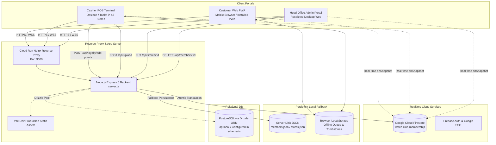
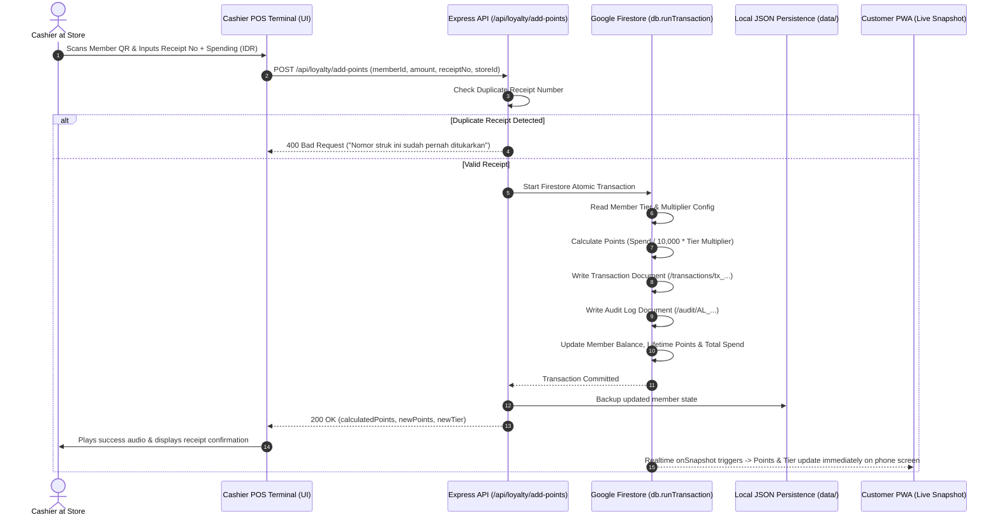
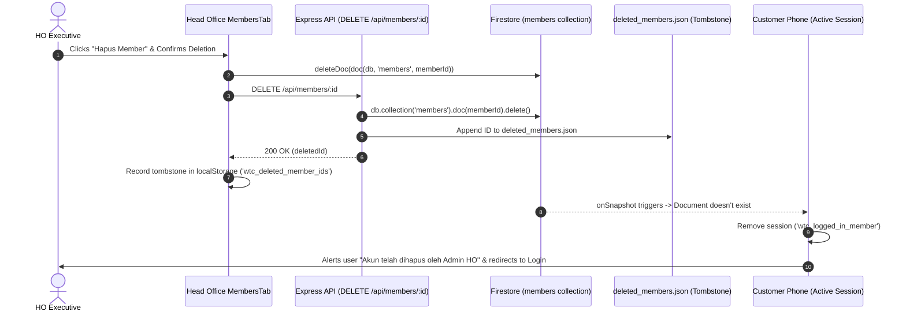

# SYSTEM ARCHITECTURE & DATA FLOW
**Document**: `PROJECT_HANDOVER/02_ARCHITECTURE.md`  
**Generated**: 2026-09-21T19:32:00-07:00

## 1. High-Level Architecture Topology

The application follows an **Omnichannel Hybrid Client-Server Architecture** designed for high resilience across 42 physical retail boutiques where internet connectivity may fluctuate.

---

## 2. Request Lifecycle & Dual-Sync Synchronization Flow

### A. Point Issuance Flow (Cashier Terminal)

### B. Member Deletion & Tombstone Flow

---

## 3. Deployment Topology & Container Boundaries
* **Runtime**: Google Cloud Run Linux container.
* **Network**: Single external ingress port `3000` via internal reverse proxy.
* **Server Binding**: Must listen on `0.0.0.0:3000`.
* **Stateful Mounts**:
  * Static file uploads at `/public/uploads` (served directly via `/uploads/*`).
  * File storage at `/data/*.json` provides hot data resilience across container restarts.
