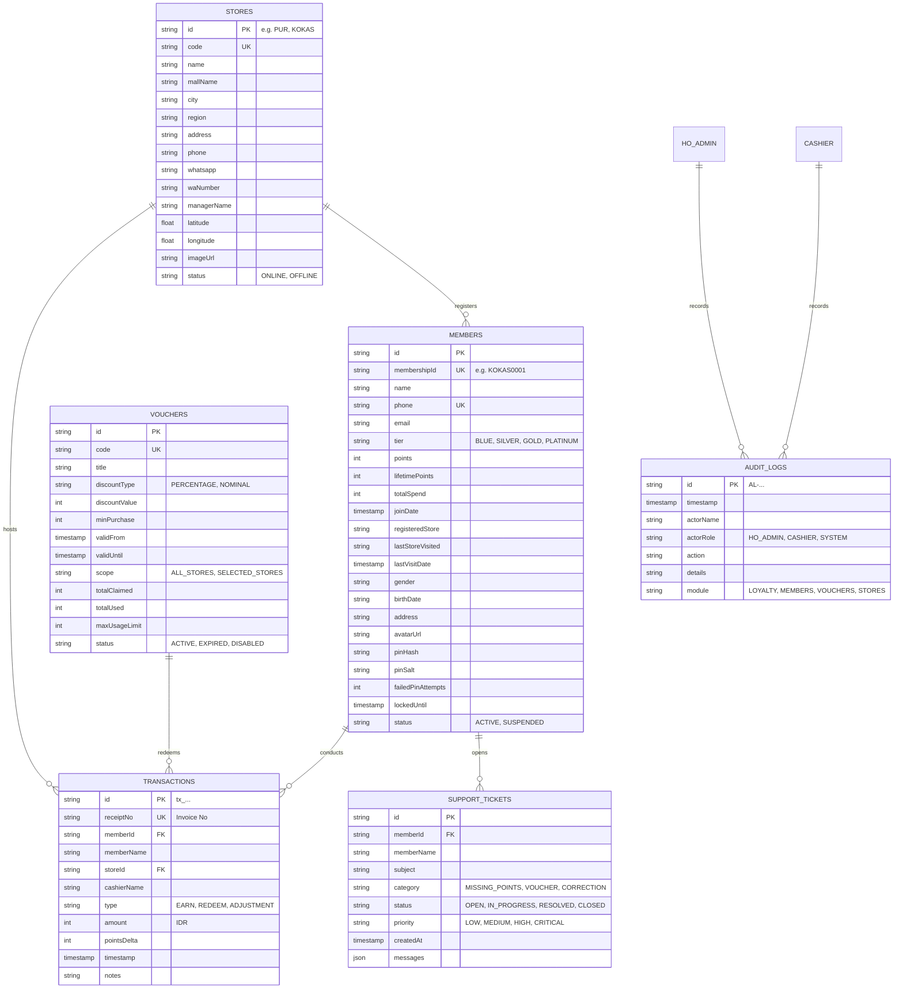

# DATABASE DOCUMENTATION & SCHEMAS
**Document**: `PROJECT_HANDOVER/06_DATABASE.md`  
**Generated**: 2026-09-21T19:32:00-07:00

## 1. Database Architecture & Double-Stack Model

The system utilizes a **dual-database design**:
1. **Google Cloud Firestore (Operational Realtime DB)**: Used directly by client PWA, POS, and HO Admin dashboards for instant reactive UI updates (`onSnapshot`).
2. **PostgreSQL via Drizzle ORM (Relational / Analytical DB)**: Schema defined in `src/db/schema.ts` for enterprise SQL reporting and transactional integrity.
3. **Flat-File JSON Storage (`data/`)**: Local filesystem persistence layer providing offline-first capability.

---

## 2. Entity Relationship Diagram (ERD)

---

## 3. Firestore Security Rules & Access Control

* **Rule File**: `/firestore.rules`
* **Version**: Rules Version 2
* **Key Constraints**:
  1. `match /transactions/{transactionId}`: `allow update, delete: if false;` (**Immutable Ledger**).
  2. `match /audit/{auditId}`: `allow update, delete: if false;` (**Immutable Audit Trail**).
  3. `match /members/{memberId}`:
     * Deletions strictly restricted (`allow delete: if isStaffOrAdmin();`).
     * Direct client mutations to `pinHash`, `pinSalt`, `failedPinAttempts`, and `lockedUntil` are blocked via rule helper `noCredentialMutation()`.
